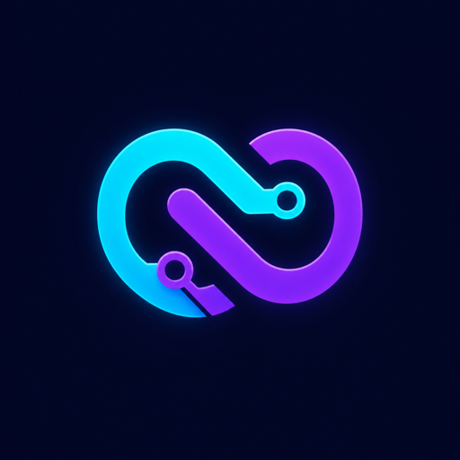

# DevLoop AI

<p align="center"></p>

**The first answer is just the beginning.**

DevLoop AI is a hackathon MVP that demonstrates loop engineering. Instead of returning the first generated solution, it plans the work, builds code, reviews it across six quality dimensions, applies the findings, and repeats until the quality score reaches 85 or the third iteration is reviewed.

## Why it exists

AI-generated code can look convincing while missing requirements, accessibility, safe error handling, or maintainability. DevLoop makes those gaps visible and shows how a controlled review-and-improve loop can produce a stronger result.

```text
Requirement
  → Plan
  → Generate
  → Review and score
  → Improve while score < 85 and iteration < 3
  → Final code and quality report
```

> Quality scores are structured LLM evaluations, not proof that generated code was compiled, executed, or security-audited. DevLoop never runs generated code.

## Demo highlights

- Live Planning → Generating → Reviewing → Improving workflow
- One-to-three inspectable code versions
- Correctness, maintainability, security, accessibility, performance, and requirement-coverage scores
- Visible score progression and a fixed stop condition
- Review findings and applied changes for every iteration
- Copyable final code and latest-run browser persistence
- OpenAI, Groq, and Gemini integrations with server-only API keys
- Safe downloadable multi-file ZIPs for project-scaffolding prompts
- Deterministic Demo mode with a reliable 58 → 76 → 91 presentation

## Tech stack

- Angular 20 standalone frontend
- Node.js 22, Express 5, and TypeScript API
- OpenAI Structured Outputs with `gpt-5.4-mini`
- Google Gen AI SDK (`@google/genai`)
- Zod structured-response validation
- Vitest/Supertest backend tests and Jasmine/Karma Angular tests
- Server-Sent Events for progressive run updates

## Project structure

```text
devloop-ai/
├── api/                  Express API, loop engine, providers, and tests
├── web/                  Angular workspace and component tests
├── docs/                 Design, plan, demo script, and checklist
├── render.yaml           One-service Render deployment
└── package.json          Workspace development, test, and build commands
```

## Run locally

Requirements: Node.js 22+ and npm 10+.

```bash
npm install
cp api/.env.example api/.env
npm run dev
```

Open [http://localhost:4200](http://localhost:4200). Angular proxies `/api` to the Express server at `http://localhost:3000`.

Demo mode is the default and requires no key:

```dotenv
LLM_PROVIDER=demo
OPENAI_API_KEY=
OPENAI_MODEL=gpt-5.4-mini
GEMINI_API_KEY=
GEMINI_MODEL=gemini-2.5-flash
GROQ_API_KEY=
GROQ_MODEL=openai/gpt-oss-120b
PORT=3000
CLIENT_ORIGIN=http://localhost:4200
```

### Use OpenAI (recommended)

Create an API key in the [OpenAI Platform](https://platform.openai.com/api-keys), add API credit, and update `api/.env`:

```dotenv
LLM_PROVIDER=openai
OPENAI_API_KEY=your_key_here
OPENAI_MODEL=gpt-5.4-mini
```

ChatGPT subscriptions and OpenAI API billing are separate. Keep this key only in the backend environment; never add it to Angular code or commit it to Git.

### Use Groq as a fallback

Create an API key in [Groq Console](https://console.groq.com/keys), then update `api/.env`:

```dotenv
LLM_PROVIDER=groq
GROQ_API_KEY=your_key_here
GROQ_MODEL=openai/gpt-oss-120b
```

### Use Gemini as a fallback

Create an API key in [Google AI Studio](https://aistudio.google.com/apikey), then update `api/.env`:

```dotenv
LLM_PROVIDER=gemini
GEMINI_API_KEY=your_key_here
GEMINI_MODEL=gemini-2.5-flash
```

Restart the development command after changing environment variables.

## Scripts

```bash
npm run dev      # API and Angular development servers
npm test         # API and Angular test suites
npm run build    # TypeScript API and production Angular bundle
```

The API also exposes:

- `GET /api/health` — server status and active provider name
- `POST /api/runs` — streamed SSE engineering loop

Example request:

```bash
curl -N http://localhost:3000/api/runs \
  -H 'Content-Type: application/json' \
  -d '{"requirement":"Create an Angular login component with validation, accessibility, loading state, and error handling."}'
```

## How the loop is controlled

`api/src/loop.ts` owns the loop rather than allowing an LLM to decide when to stop. It always follows the same policy:

1. Plan once.
2. Generate the first version.
3. Review and validate a complete score object.
4. Stop at an overall score of 85 or higher.
5. Otherwise improve and repeat, with a hard maximum of three reviewed iterations.

Provider responses are parsed and validated with Zod. OpenAI uses strict Structured Outputs; a schema-invalid successful response is retried once, while HTTP failures are surfaced as safe actionable messages without leaking raw provider details or API keys.

## Deploy to Render

The simplest deadline-safe deployment is one Render web service. Express serves both `/api/*` and the built Angular application, eliminating cross-origin configuration.

1. Push this repository to GitHub.
2. In Render, choose **New → Blueprint** and connect the repository.
3. Render detects `render.yaml` and creates `devloop-ai`.
4. Add the secret `OPENAI_API_KEY` in Render.
5. Set `LLM_PROVIDER=openai` and `OPENAI_MODEL=gpt-5.4-mini`.
6. Wait for `/api/health` to report `{"status":"ok","provider":"openai"}` (or `demo`/`groq`/`gemini` when using a fallback).
7. Open the service URL and complete the sample run before submitting it.

The build command installs locked dependencies and builds both workspaces. The start command launches the compiled Express server, which serves `web/dist/web/browser`.

## Judging walkthrough

1. State the problem: first-pass AI code often looks done before it is engineered.
2. Click **Try sample** and run the Angular login requirement.
3. Point to the live orchestrated stages.
4. Compare iterations 1, 2, and 3 as quality moves 58 → 76 → 91.
5. Show review findings, applied changes, and the six category scores.
6. Copy the final code and explain the 85-or-three stop condition.

The full recording script is in [`docs/demo-video.md`](docs/demo-video.md). The final submission audit is in [`docs/submission-checklist.md`](docs/submission-checklist.md).

## Scope and security

- No generated code execution
- No database, accounts, or authentication
- No repository ingestion or autonomous external tools
- API key remains server-side and `.env` files are ignored
- Request body is limited and requirements must contain 10–2000 characters
- Structured scores must include all six categories and values from 0–100
- Generated project archives are not executed or compile-verified by DevLoop

This narrow scope is intentional: it makes the loop easy to understand, test, deploy, and demonstrate within the hackathon deadline.
